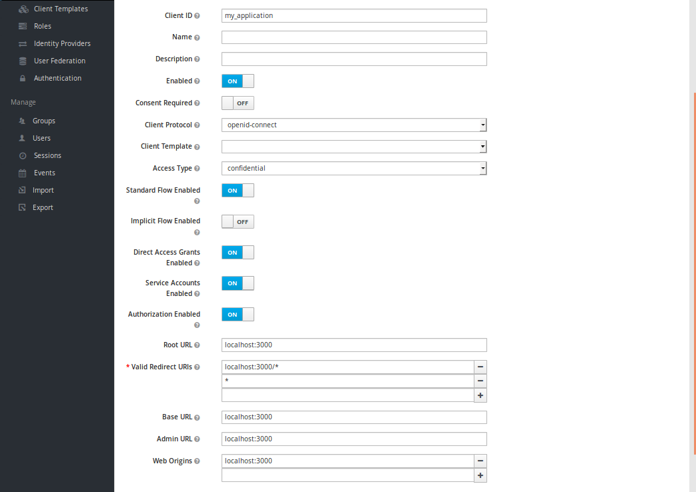

# Gem Keycloak - example

## Versions

ruby 2.5.0p0 (2017-12-25 revision 61468) [x86_64-linux]
Rails 5.1.6
gem 'keycloak', '~> 2.3', '>= 2.3.2'

---
## Description

This is a simple example of how to build an application using the Keycloak gem and using the views from your own application.

## Step by Step

*1. Clone this project

*2. Create a new realm:


*3. Configure a email to send then "forgot password" email:


*4. Create a new client in the realm:



*5. Create a new role in the client:


*5. Export installation.json file and paste in application folder. The gem will get client information at this file.:


*6. Install application gems:

```
$ bundle
```

*7. Create database:

```
$ rails db:create
$ rails db:migrate
```

*8. Start application:

```
$ rails s
```

*9. [Access application](http://localhost:3000/)


*10. Create a new user:


*11. See the new user in Keycloak:


*12. Sign In and access the main screen:


*13. Click in "Logout":


*14. Click in "Logout":


*15. Click in "I forgot my password":


*16. See your email:


* In [docs] folder there are the realm exported file and all pictures of this documentation.